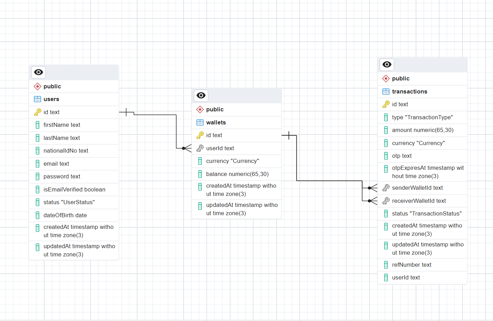
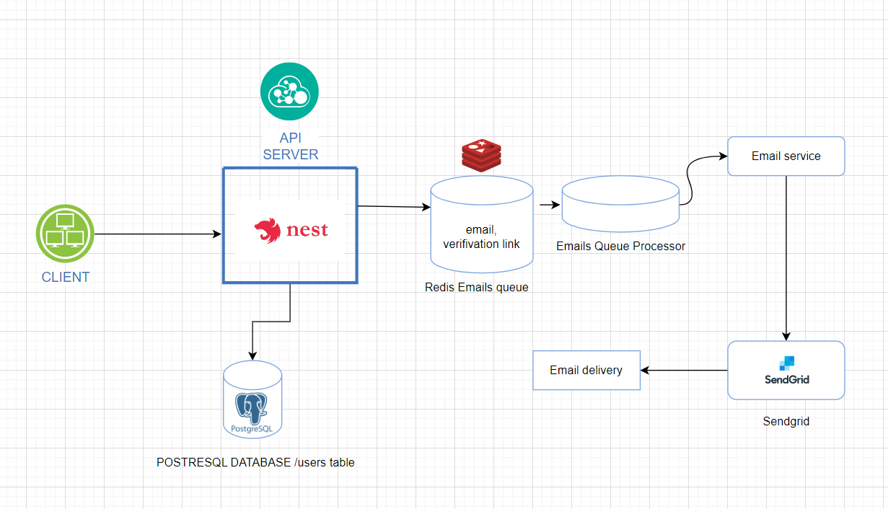
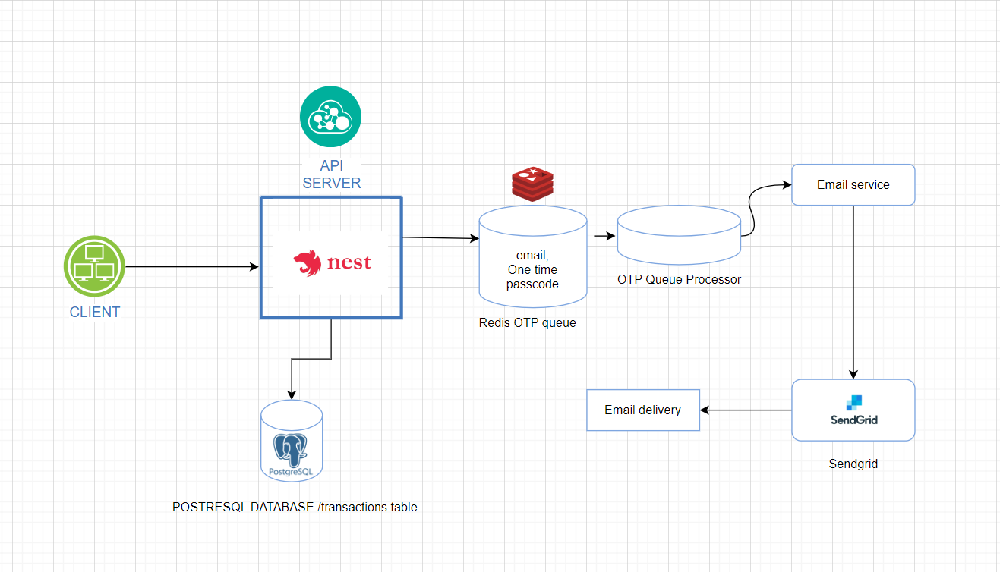
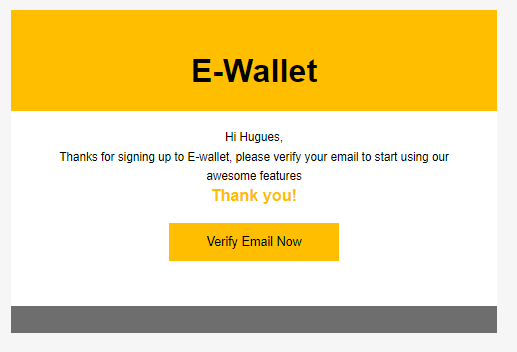
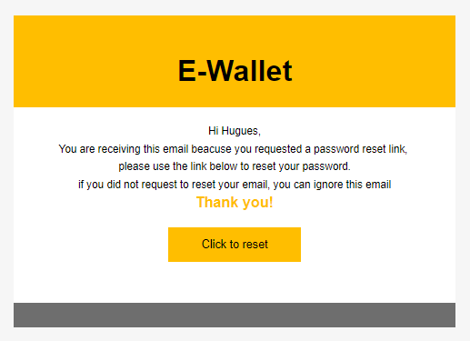
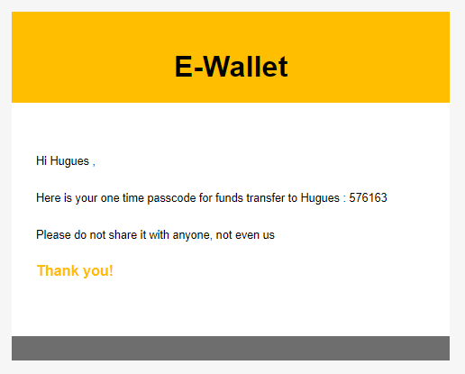
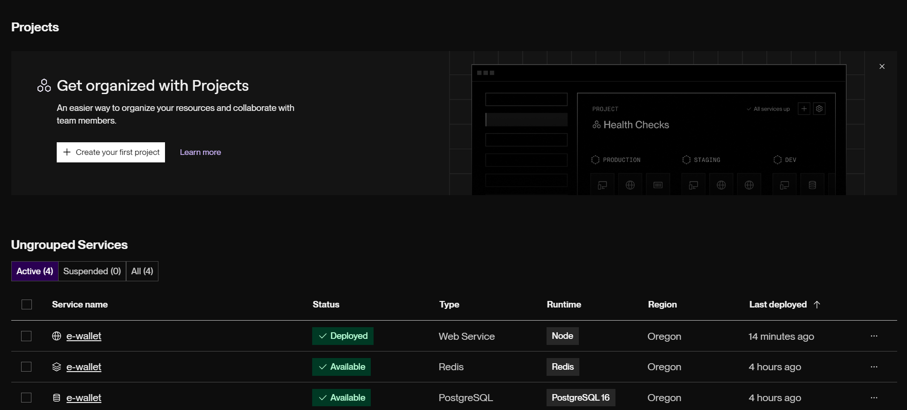

### How to Run

1. System Requirements 

- [Node.js](https://nodejs.org/en/) - v20 Recommended
- [Docker](https://docs.docker.com/install/) 
- [Docker Compose](https://docs.docker.com/compose/install/) 
- [Redis](https://redis.io/docs/latest/operate/oss_and_stack/install/install-redis/) 
- [PostgreSQL](https://www.postgresql.org/) 

2. Open the terminal and run the following commands 

- Clone the repository

```
git clone https://github.com/hugues0/e-wallet
```

- Install dependencies

```
cd e-wallet
npm install
```

- Add an .env file

```
In the root folder add .env file and refer to .env.example for what env variables required for the application to run smoothly
```

- Run prisma migrations

```
npm run prisma:migrate:dev
```

- Generate prisma generated types

```
npm run prisma:generate
```

-  Generate an optimized version of the  application for production 

```
npm run build
```

-  Start the application 

```
npm run start
```

3. the API server will be listening on [http://localhost:5000](http://localhost:5000)

4. To test the API using Swagger UI, open [http://localhost:5000/api-docs](http://localhost:5000/api-docs)


### Tech Stack 

  - [Nest js](https://nestjs.com/) A progressive Node.js framework for building efficient, reliable and scalable server-side applications.

  - [PostgreSQL](https://www.postgresql.org/) a powerful, open source object-relational database system with over 35 years of active development that has earned it a strong reputation for reliability, feature robustness, and performance.
 
  - [Swagger] an open source set of rules, specifications and tools for developing and describing RESTful APIs. The Swagger framework allows developers to create interactive, machine and human-readable API documentation.

   - [Redis] an open source set of rules, specifications and tools for developing and describing RESTful APIs. The Swagger framework allows developers to create interactive, machine and human-readable API documentation.


### Database Design

The database is comprised of 3 tables: Users, Wallets and Transactions as shown in the Entity Relationship Diagram illustration below:

 

- ### APIs for the E-wallet

   

| method             | resource         | description                                                                                    |
|:-------------------|:-----------------|:-----------------------------------------------------------------------------------------------|
| `POST`             | `api/auth/signup`         | Registration a new customer                                      |
| `POST`             | `api/auth/login`     | Authentication of an existing customer                   |
| `PATCH`             | `api/auth/verify/{email}`     | API to verify email after registration                   |
| `POST`             | `api/auth/forgot-password/{email}`     | API for sending user password reset link in case of a forgotten password                   |
| `PATCH`             | `api/auth/reset-password`     | API for resetting user password              |
| `POST`             | `api/wallets`     | API for creating a wallet for authenticated user             |
| `GET`             | `api/wallets`     | API for retrieving wallets for belonging to authenticated user             |
| `GET`             | `api/wallets/{id}`     | API for retrieving a single wallet & details like balance for authenticated user             |
| `GET`             | `api/wallets/{id}/outgoing-transactions`     | API for retrieving single wallet outgoing transactions belonging to authenticated user sorted by most recent           |
| `GET`             | `api/wallets/{id}/icoming-transactions`     | API for retrieving single wallet incoming transactions belonging to authenticated user  sorted by most recent           |
| `GET`             | `api/wallets/{id}/suggested-wallets`     | API for retrieving suggested wallets and respective owners for a single wallet (top 3 most transfered to)             |
| `GET`             | `api/wallets/{id}/montly-statement`     | APi for generating monthly wallet statement belonging to authenticated user             |
| `POST`             | `api/transactions`     | API for initiating a transaction             |
| `GET`             | `api/transactions`     | API for retrieving transactions sorted by most recent             |
| `PATCH`             | `api/transactions/confirm/{id}`     | Api for confirming and complete an initiated and pending transactions by providing a valid OTP             |


### Sign up process illustration

 

### Transaction initiation process illustration

 

### Sengrid templates with dynamic values for email verification, password reset and One Time Passcode for transactions confirmation

 
 
 

### Deployment Strategy

For the deployment of the application, I chose to utilize Render (www.render.com) as the hosting platform. All services, including the backend built with Nest.js, PostgreSQL 16, and Redis,
are running on separate instances on Render. The live version of the application is accessible at the following URL: https://e-wallet-c9ap.onrender.com/api-docs and the figure is of all running 
instances image is provided below.

 

### Trade Offs

  - For One Time Passcode, it would have been better to deliver it to phone for a better UX but I could not find a free service for delivering phone messages hence using Sendgrid to deliver OTPs to users' emails
  - For Wallet statements it would have been better to have a dedicated queue for them the email it to wallet owner after completion but I could not find a way to make the used PDF library to work with queues in time for this project
  - Altered build script to sneakly get around render (hosting service) not allowing pre-deploy scripts on free instances hence it first run prisma migrations leading to failing CI 

  
# **Author**

## **NTWARI Hugues**

